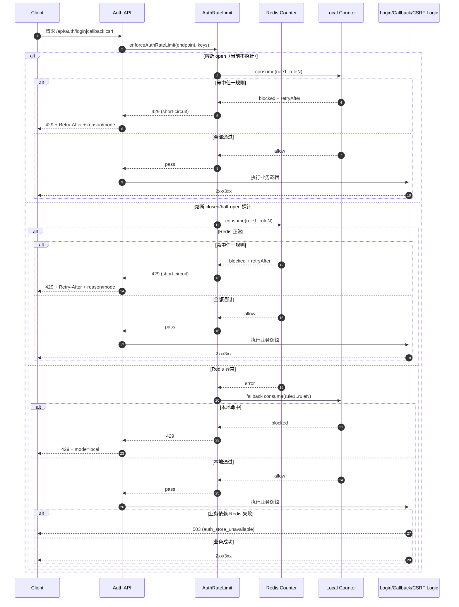
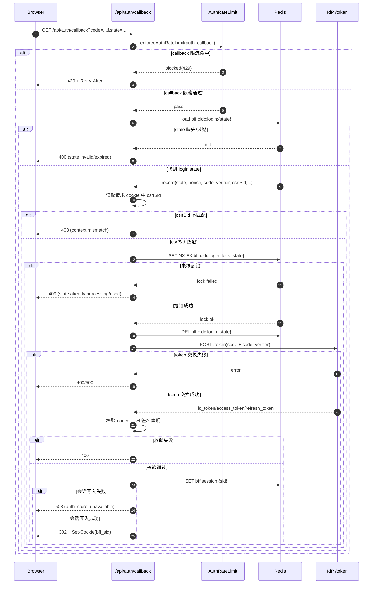

# 🛡️ 认证限流与 Redis 降级设计（NAT 友好版）

> 适用范围：`/api/auth/login`、`/api/auth/callback`、`/api/auth/csrf` 以及后续 IdP `/token` 保护。  
> 目标：避免高并发/攻击流量打穿 Redis 与 IdP，同时尽量降低 NAT 场景误伤。

---

## 1. 问题背景（为什么要做）

我们在认证链路上同时依赖：

- Redis（`state`、`session`、`csrf`、锁）
- IdP（`/auth`、`/token`）

风险是双重的：

- **流量风险**：请求洪峰会先冲击 Redis，再放大到 IdP。
- **可用性风险**：Redis 短时异常时，`fail-open` 会失去防护，`fail-close` 会把正常用户一刀切成 503。

因此不能用“单一策略”，而要用 **分层限流 + 降级状态机**。

---

## 2. 核心结论（TL;DR）

- 要加 rate limiter，但不能只按 IP。
- NAT 场景必须采用 **多维度组合键**，IP 只做“粗闸门”。
- 命中某一层限流后应 **短路返回**，不再继续内层计算。
- Redis 异常时不采用纯 fail-open / 纯 fail-close，而采用：
  - **限流层**：Redis 主存 + 本地内存保险（防洪）
  - **会话层**：敏感操作 fail-close；低风险查询可做受控降级（后续可加应急票据）
- 请求关键路径不加全局锁，优先无锁状态机（closed/open/half_open）。

---

## 3. 我们到底在 limit 什么

当前第一阶段已接入：

- `GET /api/auth/login`
- `GET /api/auth/callback`
- `GET /api/auth/csrf`

对应实现文件：

- `api/lambda/_utils/authRateLimit.ts`
- `api/lambda/auth/login.ts`
- `api/lambda/auth/callback.ts`
- `api/lambda/auth/csrf.ts`

---

## 4. 限流维度设计（解决 NAT 误伤）

### 4.1 为什么不能只按 IP

校园/企业 NAT 网关后可有上千用户。单 IP 严限会出现大面积误伤。

### 4.2 当前采用的维度

- `deviceIdHash`（有则优先）
- `ip`（粗粒度兜底）
- `global`（端点总闸门）

### 4.3 后续建议追加的维度（下一阶段）

- `username + deviceIdHash`（登录提交后）
- `username + ip`（device 缺失时）
- IdP `/token` 侧的账号维度阈值

### 4.4 当前每条规则的设计意图（why / protect / fail）

下面按当前代码中的规则逐条说明。

#### A) `auth_login_ip`

- **为什么存在**：对匿名入口做第一层“粗洪峰保护”，避免单个出口 IP 瞬时打爆认证链路。
- **保护对象**：BFF 进程、Redis、后续 IdP `/auth`。
- **何时会失效/效果变差**：
  - 攻击者分布式多 IP 发流量（单 IP 阈值被绕过）。
  - NAT 场景必须把阈值放宽，导致攻击阻断能力下降。

#### B) `auth_login_global`

- **为什么存在**：不依赖身份键，给 `/api/auth/login` 增加总闸门，防全局容量被打满。
- **保护对象**：系统总体容量（CPU、连接池、Redis QPS）。
- **何时会失效/效果变差**：
  - 只能限制“总量”，不能识别恶意来源。
  - 阈值过低会在业务高峰误伤正常流量。

#### C) `auth_login_device`

- **为什么存在**：在 NAT 下替代“单纯 IP 限流”，降低“同网关多人被连坐”。
- **保护对象**：真实终端级别公平性、登录入口可用性。
- **何时会失效/效果变差**：
  - 请求不带 `deviceIdHash`（规则不会生效）。
  - 攻击者频繁伪造/轮换设备标识，规则价值下降。

#### D) `auth_callback_ip`

- **为什么存在**：callback 是高价值入口（换 token/建 session 前），先做入口流量削峰。
- **保护对象**：`loadLoginState`、`acquireLoginStateLock`、`token exchange` 这条关键路径。
- **何时会失效/效果变差**：
  - 分布式多 IP 回调轰炸可绕过单 IP。
  - 仅靠该规则不能替代 state 单次消费与 csrfSid 绑定校验。

#### E) `auth_callback_global`

- **为什么存在**：防 callback 端点总量过高时拖垮 Redis 与 IdP token 交换。
- **保护对象**：Redis 会话中间态读写、IdP `/token`。
- **何时会失效/效果变差**：
  - 与 `auth_login_global` 一样，无法区分“恶意/正常来源”。
  - 如果与上游流量峰值不匹配，会造成整体 429 抖动。

#### F) `auth_csrf_ip`

- **为什么存在**：`/api/auth/csrf` 常被前端频繁调用，防止被滥用导致 Redis 热点写入。
- **保护对象**：`bff:csrf:*` 键空间、Redis 写负载。
- **何时会失效/效果变差**：
  - 多 IP 分散请求可规避该规则。
  - 若前端误实现导致重复请求，可能触发误限流（需要客户端缓存 token）。

#### G) `auth_csrf_global`

- **为什么存在**：给 CSRF 下发链路增加总量保护，避免系统被“低成本请求”拖垮。
- **保护对象**：BFF + Redis 的整体可用性。
- **何时会失效/效果变差**：
  - 对来源没有识别能力，只能“全局限闸”。
  - 高峰期阈值配置不当时会牺牲可用性。

---

## 5. 分层协调规则（谁先判、命中后怎么办）

原则：

1. 外层粗限（IP/global）先判，保护系统容量。
2. 内层细限（device/账号组合）再判，降低误伤。
3. **任一层命中即返回 429，短路结束。**

也就是：命中内层后，不需要再回头看外层。

---

## 5.1 规则执行时序图（短路 + 降级）

说明：

- 规则执行是“有序 + 短路”的：任一规则命中直接返回，不会继续后续规则。
- 限流层降级（Redis -> Local）与业务层失败（返回 503）是两件事，分别处理。
- `mode=local` 表示计数来自本地保险限流，不代表业务一定会成功。

---

## 6. Redis down 怎么办（避免二选一陷阱）

### 6.1 不推荐

- 纯 `fail-open`：防护失效
- 纯 `fail-close`：用户雪崩 503

### 6.2 当前第一阶段策略

- Redis 正常：走 Redis 计数（全局一致）
- Redis 异常：自动切本地内存计数（防洪）
- 认证关键写入失败（如 login/callback/csrf 存取失败）：返回 503（受控拒绝）

返回头已统一暴露：

- `Retry-After`
- `X-RateLimit-Reason`
- `X-RateLimit-Mode`（`redis` / `local`）

相关文件：

- `api/lambda/_utils/authRateLimit.ts`
- `api/lambda/_utils/cors.ts`

---

## 6.1 Callback 安全专项时序图（state + 绑定校验 + 单次消费）

设计要点：

- **先限流再读状态**：先削峰，避免 callback 直接压垮 Redis。
- **先校验 `csrfSid` 再抢锁**：避免攻击者拿泄露链接提前抢锁造成 DoS。
- **抢锁成功后立刻删 `login state`**：确保同一 `state` 单次消费，缩短重放窗口。
- **会话写入失败返回 503**：认证关键状态不可降级为 fail-open。

---

## 7. 本地计数器、内存上限与 LRU

### 7.1 local counter 的定位

- 只用于 Redis 降级时“防洪”
- 不用于登录会话真值判定

### 7.2 内存有界策略

当前实现：

- 本地 map 有上限（`AUTH_RATE_LIMIT_LOCAL_MAX_KEYS`）
- 过期键优先清理
- 超上限触发退化 LRU（按最近访问淘汰 10%）

这保证了不会无限增长。

---

## 8. 何时切到本地、何时恢复 Redis

当前是轻量熔断状态机：

- `closed`：默认走 Redis
- `open`：短时间只走本地
- `half_open`：按采样探针少量试 Redis，成功后回闭合

关键参数（可配）：

- `AUTH_RATE_LIMIT_FAIL_THRESHOLD`
- `AUTH_RATE_LIMIT_OPEN_MS`
- `AUTH_RATE_LIMIT_HALF_OPEN_SUCCESS_THRESHOLD`
- `AUTH_RATE_LIMIT_HALF_OPEN_PROBE_EVERY`

---

## 9. 恢复后是否同步 Redis 计数

当前策略：**不回灌普通计数**。

原因：

- 降级计数是短窗数据，价值有限
- 全量回灌复杂且容易引入新竞态
- 业务上更关注“防洪不中断”，不是严格会计对账

这会带来“短时计数割裂”，属于可接受 tradeoff。

---

## 10. 边界与 tradeoff（必须明确）

### 10.1 已接受的 tradeoff

- 降级期间跨实例计数不完全一致
- 恢复后不做普通计数回灌
- NAT 场景下 IP 阈值必须放宽（安全换可用性）

### 10.2 仍需补齐的点

- `username + device` 细粒度限流
- IdP `/token` 侧限流
- auth 链路监控与自动化处置（后续“token 急增踢下线”）

---

## 11. 为什么不在关键路径加“全局锁”

不建议在请求主路径加全局锁，原因：

- 会把并发请求串行化，吞吐显著下降
- 容易形成锁队头阻塞（lock convoy）
- 故障时会放大尾延迟与级联失败

更好的做法是：

- 用无锁状态机做模式切换
- 仅在“单个业务键”上做细粒度原子操作（例如 `state` 单次消费锁）

---

## 12. 与业界实践对齐（网页与 GitHub 调研）

本设计参考了以下公开实践：

- OWASP：仅靠 IP 锁定不足，账号锁定可能被 DoS 滥用  
  [OWASP Blocking Brute Force Attacks](https://owasp.org/www-community/controls/Blocking_Brute_Force_Attacks)
- `node-rate-limiter-flexible`：登录保护采用多限流器组合，并提供 Redis 失败时 insurance 策略  
  [Overall example](https://github.com/animir/node-rate-limiter-flexible/wiki/Overall-example)  
  [Insurance Strategy](https://github.com/animir/node-rate-limiter-flexible/wiki/Insurance-Strategy)
- NAT 场景社区讨论：建议引入非 IP 维度（cookie/device/user 组合）  
  [Issue #119](https://github.com/animir/node-rate-limiter-flexible/issues/119)
- OAuth 实战并发问题（refresh/token 竞争）  
  [oauth2-proxy issue #1006](https://github.com/oauth2-proxy/oauth2-proxy/issues/1006)

---

## 13. 第一阶段落地范围（已实现）

- ✅ 认证端点限流（login/callback/csrf）
- ✅ Redis 主存 + 本地保险
- ✅ 轻量熔断状态机
- ✅ 统一限流响应头与重试语义

未在本阶段实现：

- ⏳ token 急增埋点 + 自动踢下线
- ⏳ 会话层“短时签名应急票据”
- ⏳ IdP `/token` 细粒度保护

---

## 14. 配置项速查（环境变量）

总开关：

- `AUTH_RATE_LIMIT_ENABLED`（默认 true）

熔断参数：

- `AUTH_RATE_LIMIT_LOCAL_MAX_KEYS`
- `AUTH_RATE_LIMIT_OPEN_MS`
- `AUTH_RATE_LIMIT_FAIL_THRESHOLD`
- `AUTH_RATE_LIMIT_HALF_OPEN_SUCCESS_THRESHOLD`
- `AUTH_RATE_LIMIT_HALF_OPEN_PROBE_EVERY`

端点阈值（示例）：

- `AUTH_LOGIN_IP_MAX` / `AUTH_LOGIN_IP_WINDOW_SEC`
- `AUTH_LOGIN_GLOBAL_MAX` / `AUTH_LOGIN_GLOBAL_WINDOW_SEC`
- `AUTH_LOGIN_DEVICE_MAX` / `AUTH_LOGIN_DEVICE_WINDOW_SEC`
- `AUTH_CALLBACK_IP_MAX` / `AUTH_CALLBACK_IP_WINDOW_SEC`
- `AUTH_CALLBACK_GLOBAL_MAX` / `AUTH_CALLBACK_GLOBAL_WINDOW_SEC`
- `AUTH_CSRF_IP_MAX` / `AUTH_CSRF_IP_WINDOW_SEC`
- `AUTH_CSRF_GLOBAL_MAX` / `AUTH_CSRF_GLOBAL_WINDOW_SEC`

---

## 15. 下一步建议（第二阶段）

1. 补 `username + device` 和 `username + ip` 维度。  
2. 给 IdP `/token` 增加严格限流。  
3. 增加 auth 链路指标：429/503 分布、mode 切换次数、open 状态时长。  
4. 再接入“token 短时急增 -> 自动下线”处置链路。

