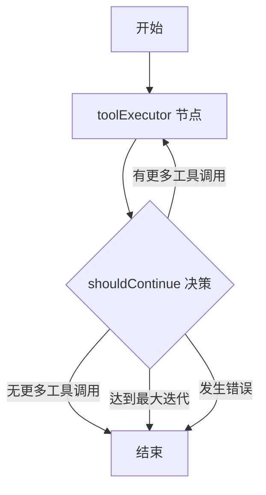

# LangGraph 多工具工作流指南

本文档介绍如何使用 LangGraphJS 实现多工具协作系统。

---

## 🎯 架构概述

```
用户输入 → AI 模型 → 工具调用检测 → LangGraph 工作流 → 多轮工具执行 → 最终结果
```

###核心组件

1. **AgentState** - 工作流状态管理
2. **toolExecutor** - 工具执行节点
3. **shouldContinue** - 决策节点
4. **StateGraph** - 状态图编排

---

## 📁 文件结构

```
api/workflows/
├── agentWorkflow.ts      # LangGraph 工作流核心
└── testWorkflow.ts       # 测试示例
```

---

## 🔧 工作流状态 (AgentState)

```typescript
{
  messages: BaseMessage[];        // 消息历史
  currentToolCall?: any;          // 当前工具调用
  toolResults: ToolResult[];      // 工具执行结果
  iterations: number;             // 迭代计数
  userId: string;                 // 用户ID
  finalResponse?: string;         // 最终回复
  error?: string;                 // 错误信息
}
```

---

## 🚀 使用示例

### 示例 1: 单个工具调用

```typescript
import { HumanMessage, AIMessage } from '@langchain/core/messages';
import { runAgentWorkflow } from './api/workflows/agentWorkflow.js';

const messages = [
  new HumanMessage({ content: '用户: 搜索AI新闻' }),
  new AIMessage({ 
    content: '<tool_call>{"tool": "search_web", "query": "AI新闻"}</tool_call>'
  }),
];

const result = await runAgentWorkflow(messages, 'user-123');

console.log('工具调用次数:', result.toolResults.length);
console.log('迭代次数:', result.iterations);
```

### 示例 2: 多轮工具调用

```typescript
// AI 可以先搜索，然后基于搜索结果创建计划

const messages = [
  new HumanMessage({ content: '帮我创建 IELTS 备考计划' }),
  new AIMessage({ 
    content: '<tool_call>{"tool": "search_web", "query": "IELTS备考策略"}</tool_call>'
  }),
];

const result = await runAgentWorkflow(messages, 'user-123', (state) => {
  console.log('当前迭代:', state.iterations);
  console.log('工具调用历史:', state.toolResults.map(t => t.tool));
});
```

---

## 🔄 工作流执行流程



### 执行逻辑

1. **提取工具调用**: 从 AI 回复中检测 `<tool_call>` 或纯 JSON
2. **验证工具**: 使用 `toolValidator` 验证工具是否存在、参数是否正确
3. **执行工具**: 调用对应的工具函数 (`search_web`, `create_plan` 等)
4. **记录结果**: 保存到 `toolResults` 数组
5. **决策**: 检查是否需要继续调用工具
6. **循环**: 最多执行 5 轮迭代

---

## 📋 支持的工具

### 1. search_web - 联网搜索

```json
<tool_call>{
  "tool": "search_web",
  "query": "搜索内容",
  "maxResults": 5,
  "searchDepth": "advanced"
}</tool_call>
```

### 2. create_plan - 创建计划

```json
<tool_call>{
  "tool": "create_plan",
  "title": "计划标题",
  "goal": "总目标",
  "tasks": [
    {
      "title": "任务1",
      "estimated_hours": 5,
      "deadline": "2025-12-31",
      "tags": ["tag1"]
    }
  ]
}</tool_call>
```

### 3. update_plan - 更新计划

```json
<tool_call>{
  "tool": "update_plan",
  "plan_id": "plan-xxx",
  "title": "新标题",
  "goal": "新目标"
}</tool_call>
```

### 4. get_plan - 获取计划

```json
<tool_call>{
  "tool": "get_plan",
  "plan_id": "plan-xxx"
}</tool_call>
```

### 5. list_plans - 列出所有计划

```json
<tool_call>{
  "tool": "list_plans",
  "limit": 10
}</tool_call>
```

---

## 🎨 多 Agent 扩展示例

LangGraph 支持多 Agent 协作，未来可以这样扩展：

```typescript
const workflow = new StateGraph(AgentStateAnnotation);

// 添加多个 Agent 节点
workflow.addNode('searchAgent', searchAgentNode);
workflow.addNode('plannerAgent', plannerAgentNode);
workflow.addNode('executorAgent', executorAgentNode);

// 设置入口
workflow.setEntryPoint('searchAgent');

// 添加条件路由
workflow.addConditionalEdges(
  'searchAgent',
  (state) => {
    if (needsPlan(state)) return 'plannerAgent';
    return '__end__';
  }
);

workflow.addConditionalEdges(
  'plannerAgent',
  (state) => {
    if (needsExecution(state)) return 'executorAgent';
    return '__end__';
  }
);

workflow.addEdge('executorAgent', '__end__');
```

---

## 🔒 安全限制

### 最大迭代次数

工作流限制最多 **5 次迭代**，防止无限循环：

```typescript
if (iterations >= 5) {
  return '__end__';
}
```

### 错误处理

任何工具执行失败都会记录错误并终止工作流：

```typescript
if (error) {
  console.log('检测到错误，结束工作流');
  return '__end__';
}
```

---

## 📊 调试和监控

### 启用详细日志

工作流会自动输出详细日志：

```
🚀 [Workflow] 开始执行 Agent 工作流
🔧 [ToolExecutor] 开始执行工具...
🔍 [ToolExecutor] 执行搜索: AI新闻
✅ [ToolExecutor] 工具 search_web 执行完成
🤔 [Decision] 当前迭代: 1/5
📍 [Workflow] 节点 "toolExecutor" 输出: {...}
✅ [Workflow] 工作流执行完成
```

### 使用回调监控状态

```typescript
const result = await runAgentWorkflow(messages, userId, (state) => {
  console.log(`[Monitor] 迭代 ${state.iterations}`);
  console.log(`[Monitor] 已调用工具: ${state.toolResults.length}`);
  
  // 可以在这里发送进度更新到前端
  sendProgressUpdate(state);
});
```

---

## 🧪 运行测试

```bash
# 安装依赖
npm install

# 运行测试（需要数据库）
node --loader ts-node/esm api/workflows/testWorkflow.ts
```

---

## 🚧 下一步开发计划

- [ ] 集成到 `chat.ts` 的流式响应
- [ ] 添加更多工具（日期查询、文件操作等）
- [ ] 实现多 Agent 协作（搜索 Agent、计划 Agent、执行 Agent）
- [ ] 添加工具调用可视化
- [ ] 支持工具调用的持久化和恢复
- [ ] 实现 Human-in-the-loop 交互

---

## 📚 参考资料

- [LangGraphJS 官方文档](https://langchain-ai.github.io/langgraphjs/)
- [LangChain Core](https://js.langchain.com/docs/modules/model_io/concepts)
- [StateGraph API](https://langchain-ai.github.io/langgraphjs/reference/classes/langgraph.StateGraph.html)

---

## 💡 最佳实践

1. **明确的工具定义**: 在 `toolValidator.ts` 中注册所有工具
2. **详细的日志**: 每个节点输出执行状态
3. **错误处理**: 捕获所有异常并记录
4. **状态管理**: 使用 Annotation 定义清晰的状态结构
5. **测试驱动**: 先写测试，再集成到生产代码

---

## ❓ 常见问题

### Q: 为什么用 `as any` 绕过类型检查？

A: LangGraphJS 的 TypeScript 类型定义还不完善，使用 `as any` 是临时解决方案。未来版本可能会改进。

### Q: 如何添加新工具？

A: 
1. 在 `toolValidator.ts` 注册工具
2. 在 `toolExecutorNode` 添加执行逻辑
3. 测试工具调用

### Q: 工作流执行太慢怎么办？

A: 
- 减少 `maxIterations`
- 优化工具执行逻辑
- 使用并行执行（未来版本支持）

---

🎉 恭喜！你已经掌握了 LangGraphJS 多工具工作流系统！

